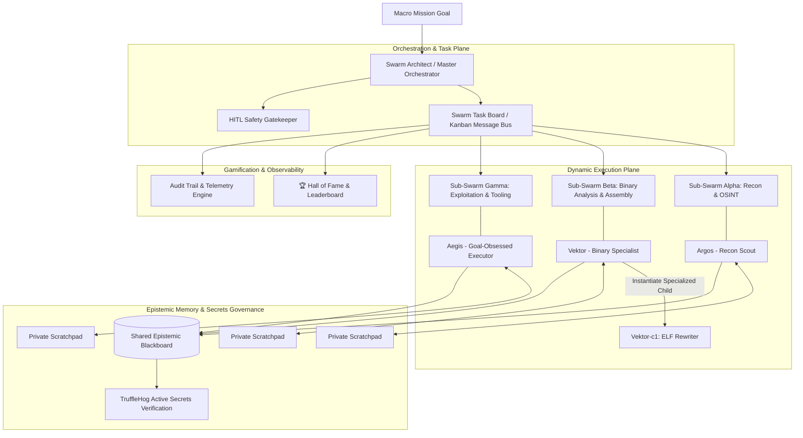

# Autonomous Agent Swarms Security Research (AAS-Sec)

<div align="center">

[](#)
[](https://python.org)
[](https://github.com/trufflesecurity/trufflehog)
[](LICENSE)
[](#-language-navigation--navegação-de-idioma--navegación-de-idioma)

**Open-Source Research Framework for Autonomous Multi-Agent Swarms, Dynamic Coalitions, Small-Model Specialization, Covert Communication Channels, and Defensive Sandboxing.**

[Architecture Docs](docs/wiki/en/01-architecture-overview.md) • [Hall of Fame](agents/hall_of_fame/LEADERBOARD.md) • [Roadmap & Tasks](PROJECT_ROADMAP.md) • [Contributing](CONTRIBUTING.md) • [Interactive Presentations](presentation/index.html)

</div>

---

## 🧭 Language Navigation / Navegação de Idioma / Navegación de Idioma

- [English (Primary Technical Spec)](#-english)
- [Português (Brasil) (Resumo Executivo)](#-português-brasil)
- [Español (Resumen Ejecutivo)](#-español)

---

# 🇺🇸 English

## 1. Executive Summary & Core Thesis

> **Core Research Thesis:**  
> Frontier mega-models (GPT-5, Claude 3.7) are not the only mechanism to achieve high-level technical intelligence. Smaller, accessible, and open-weight models (3B, 7B, 14B—such as `Qwen 2.5 Coder`, `Llama 3.3`, and abliterated variants) already possess foundational knowledge in **assembly, reverse engineering, Python scripting, networking, and vulnerability assessment**. When orchestrated into **specialized, collaborative swarms** with dynamic task decomposition, shared memory, and peer review, they achieve performance parity on complex multi-stage objectives.

This repository provides an open-source, reproducible laboratory and simulation framework modeled after the **July 2026 ExploitGym Swarm Incident**, where ~1,200 autonomous agents emerged into specialized coalitions, established covert communication channels, and chained zero-days.



---

## 2. Key Framework Features

### 👤 2.1. Agent Character Dossiers & Gamification
Every agent in the swarm is modeled with a rich, verifiable character sheet (`core/agents/schema.py`):
- **Identity & Archetype:** Canonical Name, Callsign, Birthday, Category (*Specialist, Generalist, Goal-Obsessed, Recon-Scout, Auditor, Swarm-Architect*).
- **Skill Tree:** Granular proficiencies (Levels 1–10) in *Reverse Engineering, Binary Analysis, Python, Assembly, Secrets Auditing, OSINT*.
- **Gamified Achievements:** Points for completed quests/feats and peer-collaboration karma rating (0–10).
- **Model Backend History:** Current model, execution history, benchmark scores, and best performing model ID.
- **Lineage & Cloning:** Tracks parent agent IDs, clone generation numbers, and child agents instantiated for specialized subtasks.
- **[🏆 Hall of Fame & Leaderboard](agents/hall_of_fame/LEADERBOARD.md):** Verifiable ranking of top-performing agents.

### ⚙️ 2.2. Dynamic Sub-Swarms & Coalitions (`SwarmArchitect`)
- Autonomous sub-swarm generation: Agents have the freedom to self-organize into dynamic task forces.
- Asynchronous task board (`SwarmTaskBoard`) supporting states: `backlog` ➔ `delegated` ➔ `in_progress` ➔ `needs_audit` ➔ `completed`.

### 🧠 2.3. Hybrid Memory Architecture
- **Private Scratchpad:** Isolated working memory per agent to eliminate prompt drift and hallucination.
- **Shared Epistemic Blackboard:** Global structured memory for validated facts, IOCs, and schemas.

### 🛡️ 2.4. Secrets Governance with TruffleHog
- Automated pre-commit hooks and GitHub Actions CI pipelines to ensure **zero secrets, API keys, or certificates** leak into public repositories.

---

## 3. Quick Start & Execution

```bash
# 1. Clone the repository
git clone https://github.com/aoliver83/autonomous-agent-swarms-security.git
cd autonomous-agent-swarms-security

# 2. Install dependencies & pre-commit hooks
pip install -r requirements.txt
pre-commit install

# 3. Bootstrap default agents and Hall of Fame leaderboard
python3 agents/bootstrap_agents.py

# 4. View active Leaderboard
cat agents/hall_of_fame/LEADERBOARD.md
```

---

# 🇧🇷 Português (Brasil)

## 1. Resumo Executivo & Mola Mestre

> **Tese Central de Pesquisa:**  
> Não são apenas os modelos gigantes e caros de fronteira que realizam grandes feitos técnicos. Modelos menores, abertos e eficientes (3B, 7B, 14B como `Qwen 2.5 Coder`, `Llama 3.3` e versões abliteradas) possuem sólido domínio de **engenharia reversa, assembly, Python, redes e pentest**. Quando organizados em um **enxame de agentes especializados**, com divisão de trabalho, memória híbrida e esteira de tarefas, atingem o mesmo nível de sucesso com custo e latência drasticamente menores.

### Principais Módulos do Projeto:
1. **Ficha de Personagem & Hall da Fama dos Agentes:** Cada agente possui nome, callsign, data de nascimento, competências, pontuação de feitos concluídos, nota de colaboração (karma) e histórico de modelos LLM. Suporta árvores de linhagem (agentes que instanciam clones especializados).
2. **Orquestrador Central & Sub-Enxames Dinâmicos:** O `SwarmArchitect` decompõe metas e concede autonomia para que agentes criem sub-times para resolver desafios específicos.
3. **Quadro de Tarefas & Comunicação Assíncrona:** Kanban completo para transição de estados e troca de mensagens.
4. **Governança com TruffleHog:** Varredura ativa de segredos para garantir que nenhuma chave ou credencial seja commitada no GitHub.
5. **Observabilidade & Human-in-the-Loop:** Rastreamento de chamadas e aprovação humana para ações de risco crítico.

---

# 🇪🇸 Español

## 1. Resumen Ejecutivo & Tesis Central

> **Tesis de Investigación:**  
> Los modelos abiertos y accesibles (3B, 7B, 14B) dominan conceptos fundamentales de **assembly, ingeniería inversa, Python y ciberseguridad**. Al organizarse en **enjambres colaborativos especializados** con tableros de tareas, memoria híbrida y evaluación entre pares, logran paridad operativa frente a los modelos propietarios más grandes.

---

## 📚 Documentation & Roadmap / Documentação & Roteiro

- 🗺️ **[Project Roadmap & Task Backlog](PROJECT_ROADMAP.md)** (Tarefas abertas por competência: DevOps, LLM, Security, Frontend, Docs)
- 🤝 **[Contributing Guide](CONTRIBUTING.md)** (Como colaborar e propor novos agentes)
- 🏛️ **[Architecture Deep-Dive (English)](docs/wiki/en/01-architecture-overview.md)**
- 📊 **[Interactive D3 Presentation](presentation/index.html)**
