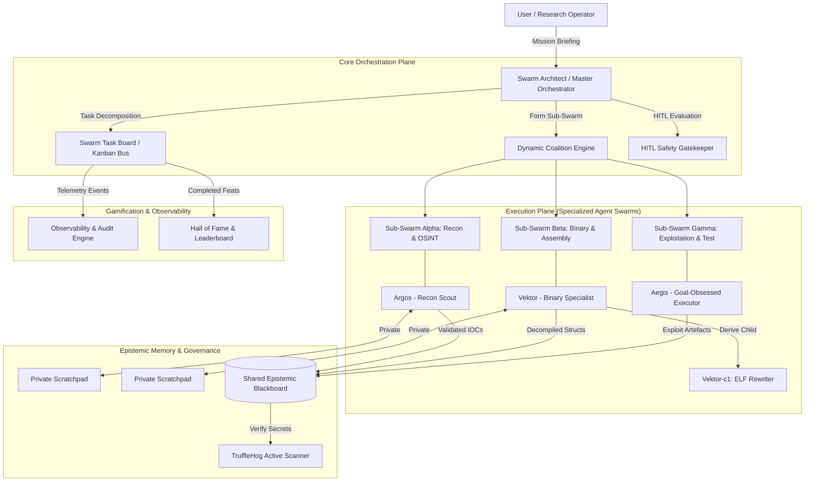

# Architecture Overview — Autonomous Agent Swarms Security (AAS-Sec)

---

## 1. Core Principles

1. **Model Agnosticism & Small Model Empowerment:**  
   Open models (`3B`, `7B`, `14B`) are treated as first-class citizens. By distributing tasks into atomic units, smaller models execute with high precision without context degradation.
2. **Dynamic Coalition Formation:**  
   Agents are not locked into static graphs. When a subtask demands deep focus (e.g., analyzing an ELF header or extracting APK components), the swarm dynamically spins up a specialized sub-swarm.
3. **Agent Character Dossiers & Lineage:**  
   Every agent has a verifiable character sheet, skill proficiencies, historical feats, peer karma, and lineage records tracking parent-child clone derivations.
4. **Defensive Hardening & Zero Secrets Leak:**  
   Integrated with TruffleHog in pre-commit and CI, ensuring all shared discoveries and commits are free of sensitive secrets.
